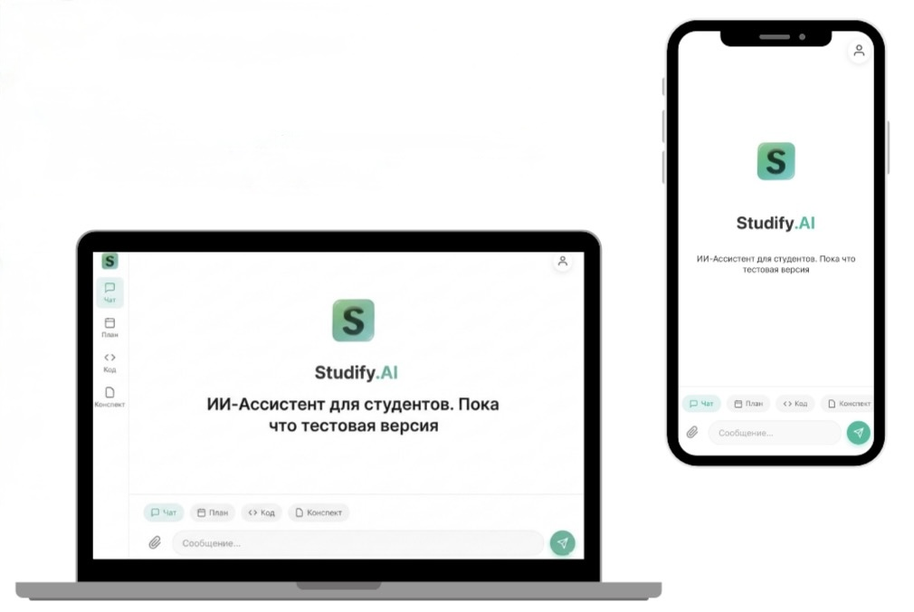

Studify.ai

Интеллектуальный инструмент для учебы с интегрированным ИИ.
Создан для студентов Казахстана.

О проекте

Studify.ai — это AI-платформа, помогающая студентам:
	•	Разбирать сложные темы простым языком
	•	Генерировать учебные конспекты
	•	Подготавливаться к экзаменам
	•	Работать с кодом и техническими заданиями
	•	Учиться быстрее и эффективнее

Проект ориентирован на аудиторию Республики Казахстан и поддерживает русский и казахский языки.

Онлайн версия:
https://studify-app.pages.dev/

🎯 Цель проекта

Создать доступный AI-инструмент для студентов Казахстана, который объединяет интеллектуальный поиск, структурирование информации и помощь в обучении в одном месте.
Лицензия

MIT License

