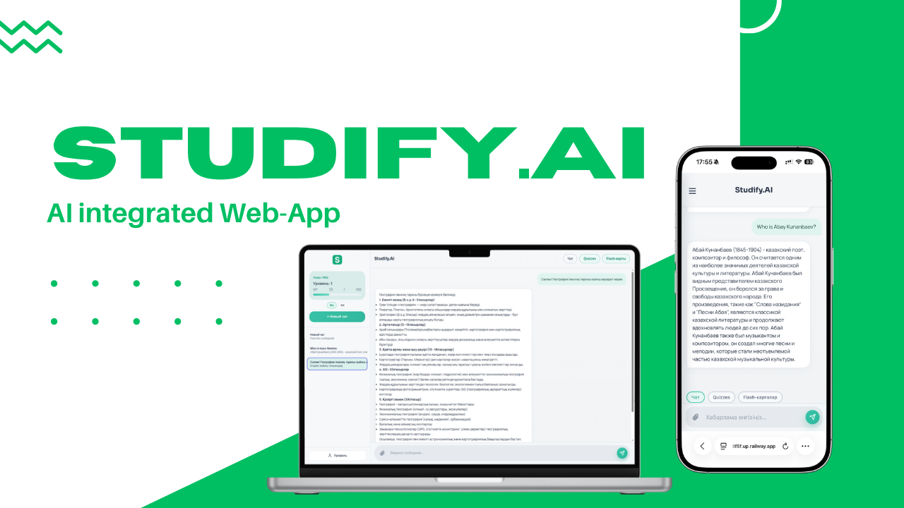

# 🚀 Studify.AI — Intelligence as a Service for Students


**Studify.AI** — это интеллектуальная образовательная экосистема, разработанная специально для студентов Казахстана. Мы переосмыслили процесс обучения, внедрив современные AI-технологии для глубокой персонализации учебного процесса.

---

## 🌟 Ключевые возможности

* **Hybrid RAG Architecture**: Сервис не просто генерирует текст, а ищет ответы в загруженных методичках и учебниках, что минимизирует галлюцинации ИИ.
* **Мультиязычный интеллект**: Полная поддержка казахского (кириллица) и русского языков с учетом культурного и языкового контекста.
* **Генерация учебных материалов**: Автоматическое создание интерактивных квизов и флеш-карточек (Anki-style) на основе ваших конспектов или PDF-файлов.
* **Умный разбор сложных тем**: Адаптивные объяснения сложных концепций (физика, математика, IT) простым и понятным языком.

---

## 🛠 Технологический стек

Проект построен на производительном стеке, готовом к масштабированию:

| Компонент | Технология |
| :--- | :--- |
| **Backend** | Python (FastAPI) |
| **Database** | PostgreSQL + **pgvector** для векторного поиска |
| **AI Engine** | OpenRouter API (GPT-4o, Claude 3.5) |
| **Embeddings** | Multilingual-E5 (Lightweight & Fast) |
| **Infrastructure** | Railway (Cloud Deployment) |

---

## 📂 Структура проекта

```text
studify-ai/
├── main.py              # Основной API сервис и роутинг
├── database.py          # Конфигурация PostgreSQL & SQLAlchemy
├── vector_service.py    # RAG: логика эмбеддингов и векторного поиска
├── auth.py              # Система аутентификации пользователей
├── static/              # Frontend активы (JS, CSS, логотипы)
├── index.html           # Основной интерфейс приложения
└── requirements.txt     # Зависимости проекта
```

## 🌍 Миссия проекта
Мы стремимся сделать качественное образование доступным для каждого студента в Казахстане. Studify.AI помогает сократить время на рутинную обработку информации, позволяя сфокусироваться на реальном понимании предмета.

Онлайн версия 👉 https://studify-app.me/
---
Developed by sautbekov077 and ITEA with ❤️ for Kazakhstan's students.